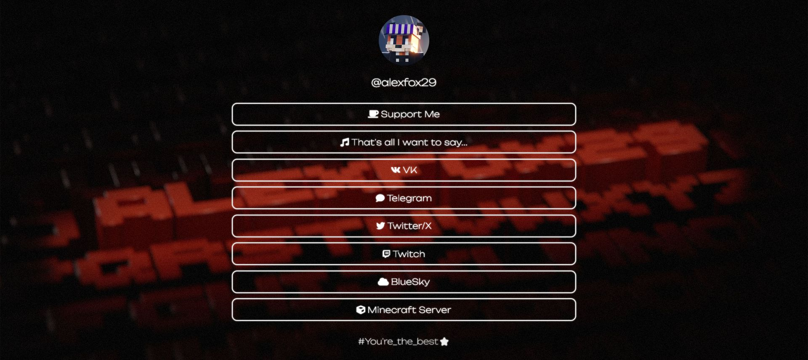

<h1 align="center">Linktree</h1>
<h3 align="center">Simple site to group all my profiles on social networks in one place.</h3>

  
  
  
  
  
	

  <a href="#-about-the-project">About the project</a>&nbsp;&nbsp;&nbsp;|&nbsp;&nbsp;&nbsp;
  <a href="#-license">License</a>

---

  

---

## 💡 About the project

This is a page with all my links

## 📝 License

This project is under the MIT license. See the [LICENSE](LICENSE.md) file for more details.

---

Made with ❤️ by John Emerson :wave: [Get in touch](https://johnggli.github.io/linktree)
